# StockIQ - System Specification

## Purpose

This document defines the high-level system specification for StockIQ, a production-grade paper trading platform supporting real-time market data, a low-latency matching engine, social features, and analytics. It describes the architecture, component responsibilities, event flows, storage choices, non-functional requirements, deployment considerations, and initial development tasks.

> Note: This spec follows the microservices architecture and the diagram provided by the project owner.

---

## 1. Objectives & Scope

Primary objective:
- Provide a reliable, observable, and extensible paper trading platform where users can place orders, see real-time market and portfolio updates, share trades socially, and analyze performance.

Scope (initial MVP):
- Core services: Authentication, Trading API, Matching Engine, Market Data ingestion, Portfolio, Wallet, WebSocket broadcaster, Notifications, Social and Analytics.
- Persistence: PostgreSQL (primary data) + TimescaleDB (time-series) + Redis (cache/session) + Kafka (event bus).
- Expose REST APIs for all CRUD workflows and WebSocket for real-time streaming.
- Focus on correctness, observability and resilient event-driven flows.

---

## 2. High-Level Architecture

The platform follows a microservices architecture with clear separation of concerns across layers:

```mermaid
---
config:
  layout: elk
  theme: dark
  themeVariables:
    fontSize: 24px
    fontFamily: 'Arial, sans-serif'
    primaryTextColor: '#ffffff'
    secondaryTextColor: '#ffffff'
    tertiaryTextColor: '#ffffff'
    clusterBkg: '#2a2a2a'
    clusterBorder: '#666666'
    titleColor: '#ffffff'
    edgeLabelBackground: '#1a1a1a'
    nodePadding: 20
    rankSpacing: 80
    nodeSpacing: 60
---
flowchart TB
    subgraph Client[" "]
        WebApp("🌐 Web Application<br/>Responsive Design<br/>Desktop • Tablet • Mobile")
        MobileApp("📱 Mobile Application<br/>Native iOS & Android<br/>Optional Future Release")
    end

    subgraph Security[" "]
        Auth("Auth Service<br/>━━━━━━━━━<br/>• User Management<br/>• JWT Tokens<br/>• Session Handling<br/>• Role-Based Access<br/>━━━━━━━━━<br/>PostgreSQL + Redis")
        ApiGW("API Gateway<br/>━━━━━━━━━<br/>NGINX / Kong / AWS<br/>━━━━━━━━━<br/>• JWT Validation<br/>• Rate Limiting<br/>• Load Balancing<br/>• SSL Termination")
    end

    subgraph CoreTrading[" "]
        Trading("Trading Service<br/>━━━━━━━━━<br/>• Order Placement<br/>• Order Validation<br/>• Order History<br/>• Order Status<br/>━━━━━━━━━<br/>PostgreSQL + Redis")
        
        Matching("Matching Engine<br/>━━━━━━━━━<br/>• Order Book Management<br/>• Buy/Sell Matching<br/>• Trade Execution<br/>• Price-Time Priority<br/>━━━━━━━━━<br/>Redis In-Memory")
        
        Portfolio("Portfolio Service<br/>━━━━━━━━━<br/>• Holdings Tracking<br/>• P&L Calculation<br/>• Performance Metrics<br/>• Risk Analysis<br/>━━━━━━━━━<br/>PostgreSQL")
    end

    subgraph MarketServices[" "]
        Market("Market Data Service<br/>━━━━━━━━━<br/>• Real-time Prices<br/>• Historical Data<br/>• OHLCV Charts<br/>• Market Depth<br/>━━━━━━━━━<br/>TimescaleDB + Redis")
        
        Analytics("Analytics Service<br/>━━━━━━━━━<br/>• Trade Statistics<br/>• User Rankings<br/>• Performance Reports<br/>• Leaderboards<br/>━━━━━━━━━<br/>TimescaleDB")
    end

    subgraph UserServices[" "]
        Social("Social Service<br/>━━━━━━━━━<br/>• User Profiles<br/>• Follow System<br/>• Trade Sharing<br/>• Comments & Likes<br/>━━━━━━━━━<br/>PostgreSQL + Elasticsearch")
        
        Notification("Notification Service<br/>━━━━━━━━━<br/>• Email Alerts<br/>• Push Notifications<br/>• SMS Alerts<br/>• Trade Confirmations<br/>━━━━━━━━━<br/>SendGrid + FCM + Twilio")
        
        Wallet("Wallet Service<br/>━━━━━━━━━<br/>• Virtual Balance<br/>• Deposits/Withdrawals<br/>• Transaction History<br/>• Fund Management<br/>━━━━━━━━━<br/>PostgreSQL")
    end

    subgraph EventSystem[" "]
        MQ("Message Broker<br/>━━━━━━━━━<br/>Apache Kafka / RabbitMQ<br/>━━━━━━━━━<br/>Event Topics:<br/>• order.placed<br/>• order.matched<br/>• trade.executed<br/>• portfolio.updated<br/>• market.data.update<br/>• notification.trigger")
    end

    subgraph DataLayer[" "]
        PG[("🗄️ PostgreSQL<br/>━━━━━━━━━<br/>Primary Database<br/>Users • Orders<br/>Trades • Social Data")]
        
        RDS[("⚡ Redis Cluster<br/>━━━━━━━━━<br/>Cache & Real-time<br/>Sessions • Order Book<br/>Active Orders")]
        
        TSDB[("📊 TimescaleDB<br/>━━━━━━━━━<br/>Time-Series Data<br/>Price History • OHLCV<br/>Analytics • Metrics")]
        
        ES[("🔍 Elasticsearch<br/>━━━━━━━━━<br/>Search & Logs<br/>User Search<br/>Application Logs")]
        
        S3[("📦 S3 / MinIO<br/>━━━━━━━━━<br/>Object Storage<br/>Profile Images<br/>Reports • Backups")]
    end

    subgraph Operations[" "]
        Monitor("🔍 Monitoring<br/>━━━━━━━━━<br/>Prometheus + Grafana<br/>ELK Stack<br/>Sentry + Jaeger")
        
        Deploy("🚀 Deployment<br/>━━━━━━━━━<br/>Docker + Kubernetes<br/>CI/CD Pipeline<br/>Cloud: AWS/GCP/Azure")
    end

    %% Client to Gateway
    WebApp -->|HTTPS| ApiGW
    MobileApp -.->|HTTPS| ApiGW
    
    %% Gateway to Auth
    ApiGW --> Auth
    
    %% Gateway to Services
    ApiGW --> Trading
    ApiGW --> Portfolio
    ApiGW --> Market
    ApiGW --> Analytics
    ApiGW --> Social
    ApiGW --> Notification
    ApiGW --> Wallet
    
    %% Core Trading Flow
    Trading -->|Submit Order| Matching
    Matching -->|Trade Executed| Portfolio
    Market -->|Price Alert| Notification
    
    %% Event-Driven Architecture
    Auth --> MQ
    Trading --> MQ
    Matching --> MQ
    Portfolio --> MQ
    Market --> MQ
    Analytics --> MQ
    Social --> MQ
    Notification --> MQ
    Wallet --> MQ
    
    %% Database Connections
    MQ --> PG
    MQ --> RDS
    MQ --> TSDB
    MQ --> ES
    MQ --> S3
    
    Auth --> PG
    Auth --> RDS
    Trading --> PG
    Trading --> RDS
    Portfolio --> PG
    Matching --> RDS
    Market --> TSDB
    Market --> RDS
    Analytics --> TSDB
    Social --> PG
    Social --> ES
    Wallet --> PG
    
    %% Operations
    CoreTrading -.-> Monitor
    MarketServices -.-> Monitor
    UserServices -.-> Monitor
    DataLayer -.-> Monitor
    
    CoreTrading -.-> Deploy
    MarketServices -.-> Deploy
    UserServices -.-> Deploy

    %% Vibrant Neon Dark Mode Styling
    classDef client fill:#0d1b2a,stroke:#00d9ff,stroke-width:4px,color:#00d9ff,font-size:24px,padding:15px
    classDef security fill:#1a0f2e,stroke:#b400ff,stroke-width:4px,color:#e0b3ff,font-size:24px,padding:15px
    classDef core fill:#0a2e0d,stroke:#00ff88,stroke-width:4px,color:#88ffcc,font-size:24px,padding:15px
    classDef market fill:#2e1a00,stroke:#ff9500,stroke-width:4px,color:#ffcc80,font-size:24px,padding:15px
    classDef user fill:#2e0042,stroke:#ff00ff,stroke-width:4px,color:#ff99ff,font-size:24px,padding:15px
    classDef event fill:#002e2e,stroke:#00ffff,stroke-width:4px,color:#80ffff,font-size:24px,padding:15px
    classDef data fill:#2e1f00,stroke:#ffdd00,stroke-width:4px,color:#ffee99,font-size:24px,padding:15px
    classDef ops fill:#1a1a2e,stroke:#7c8db5,stroke-width:4px,color:#c5d4ff,font-size:24px,padding:15px

    class WebApp,MobileApp client
    class Auth,ApiGW security
    class Trading,Matching,Portfolio core
    class Market,Analytics market
    class Social,Notification,Wallet user
    class MQ event
    class PG,RDS,TSDB,ES,S3 data
    class Monitor,Deploy ops
```

Key components:
- API Gateway: authentication, rate-limiting, TLS termination, routing.
- Microservices: Auth, Trading, Matching Engine, Market Data, Portfolio, Wallet, Social, Analytics, Notification, WebSocket/Realtime.
- Message Broker: Kafka for durable event streams and pub/sub between services.
- Data Stores: PostgreSQL, TimescaleDB, Redis, Elasticsearch, S3.
- Observability: Prometheus, Grafana, Jaeger, ELK, Sentry.

---

## 3. Technology Stack

### Backend Services
- **Primary Framework**: Spring Boot 3.x (Java 17+ or Java 21 LTS)
- **Spring Ecosystem**:
  - **Spring Web**: RESTful API development
  - **Spring WebFlux**: Reactive programming for high-throughput services (Matching Engine, Market Data)
  - **Spring Data JPA**: PostgreSQL/TimescaleDB integration with Hibernate
  - **Spring Data Redis**: Redis operations and caching
  - **Spring Kafka**: Kafka producer/consumer integration
  - **Spring Security**: Authentication, authorization, JWT handling
  - **Spring WebSocket**: Real-time bidirectional communication (STOMP over WebSocket)
  - **Spring Cloud**: Service discovery (Eureka), config management, circuit breakers (Resilience4j)
  - **Spring Actuator**: Health checks, metrics exposure for Prometheus
  - **Spring Batch**: Scheduled jobs for analytics and reports

### Data Layer
- **PostgreSQL 15+**: Primary relational database
- **TimescaleDB**: Time-series extension for PostgreSQL (market data, analytics)
- **Redis 7+**: Caching, session management, pub/sub, real-time data
- **Elasticsearch 8+**: Full-text search and log aggregation
- **S3 / MinIO**: Object storage for files and backups
- **Flyway / Liquibase**: Database migration and versioning

### Message Broker
- **Apache Kafka**: Event streaming and inter-service communication
- **Alternative**: RabbitMQ (if lower latency needed for specific use cases)

### Infrastructure & DevOps
- **Containerization**: Docker with multi-stage builds (Maven/Gradle + JRE slim images)
- **Orchestration**: Kubernetes (EKS on AWS)
- **Service Mesh**: Istio or Linkerd (optional, for advanced traffic management)
- **API Gateway**: Spring Cloud Gateway, NGINX, Kong, or AWS API Gateway
- **CI/CD**: GitHub Actions or GitLab CI
- **IaC**: Terraform for infrastructure provisioning
- **Build Tools**: Maven or Gradle

### Observability
- **Metrics**: Micrometer (Spring Actuator) → Prometheus + Grafana
- **Logging**: SLF4J + Logback → ELK Stack (Elasticsearch, Logstash, Kibana)
- **Tracing**: Spring Cloud Sleuth + Zipkin or Jaeger for distributed tracing
- **Error Tracking**: Sentry
- **APM**: Optional - Datadog, New Relic, or Elastic APM for application performance monitoring

### External Services
- **Email**: SendGrid or AWS SES
- **Push Notifications**: Firebase Cloud Messaging (FCM)
- **SMS**: Twilio
- **Market Data**: Binance WebSocket API, CoinGecko API (fallback)

### Development Tools & Libraries
- **Testing**: JUnit 5, Mockito, Spring Boot Test, Testcontainers for integration tests
- **Load Testing**: k6, Gatling, JMeter
- **API Documentation**: Springdoc OpenAPI (Swagger UI)
- **Code Quality**: SonarQube, Checkstyle, SpotBugs
- **Lombok**: Reduce boilerplate code
- **MapStruct**: Bean mapping
- **Validation**: Jakarta Bean Validation (Hibernate Validator)

---

## 4. Component Responsibilities

Auth Service
- User registration, login, JWT issuance and revocation, password hashing, session management (Redis), role/permission checks.
- Exposes: /auth/* endpoints and a public health endpoint.

Trading Service
- Order entry API, validation, persistence of orders, balance locks via Wallet Service, producing `order.placed` events.
- Exposes: POST /orders, GET /orders, GET /orders/{id}, DELETE /orders/{id}.

Matching Engine
- In-memory order books per symbol, price-time priority matching, trade execution creation, audit logging, and reliable publication of `trade.executed` events.
- Single responsibility: deterministic matching logic; persist audit logs to DB.

Market Data
- Connects to external exchanges (Binance), normalizes feeds, writes raw ticks to TimescaleDB and caches last prices in Redis; publishes `market.data.update` events.

Portfolio Service
- Consumes `trade.executed`, applies FIFO cost basis or configured cost method, updates positions, computes realized/unrealized P&L, writes portfolio snapshots.

Wallet Service
- Virtual balance accounting (double-entry), lock/unlock funds for orders, transaction history and audit; prevents negative balances and supports concurrency-safe operations.

WebSocket / Real-time Broadcaster
- Subscribes to Redis/Kafka channels and forwards messages to authenticated clients; supports subscription channels (orderbook, trades, ticker, user channels).

Notification Service (with Worker)
- Routes events to delivery channels (in-app, email via SendGrid, push via FCM, SMS via Twilio). Uses background worker queue for async tasks and retries.

Analytics & Leaderboard
- Batch + incremental calculations: Sharpe, Sortino, Drawdown, leaderboards in Redis sorted sets, exposes metrics endpoints.

Social Service
- User profiles, follow/followers, shared trades, likes and comments, feed generation (mix of chronological and engagement-ranked). Stores metadata in PostgreSQL and uses Redis for counters.

---

## 5. Event Topics (Kafka)

Core topics:
- order.placed — carries order metadata (trading → matching engine)
- order.cancelled — cancel requests
- order.matched / order.updated — updates on order state
- trade.executed — single source of truth for trade executions (consumed by Portfolio, Wallet, Analytics, Notification, Social)
- portfolio.updated — snapshot or delta after trades
- market.data.update — normalized price ticks and BBO updates
- user.notification — notifications to send

Message contract guidelines:
- Use JSON with explicit schema versioning and a small header {"schema_version": "v1", "event_type": "trade.executed"}.
- Include trace identifiers for distributed tracing (trace_id, span_id).
- Keep messages idempotent with unique event_id and sequence numbers where necessary.

---

## 6. Data Model (high-level)

Primary relational tables (Postgres):
- users (id, email, username, hashed_password, created_at, ...)
- orders (id, user_id, symbol, side, type, price, quantity, filled_qty, status, created_at, updated_at)
- trades (id, buy_order_id, sell_order_id, symbol, price, qty, taker_order_id, maker_order_id, executed_at)
- portfolios (id, user_id, snapshot_time, total_value, cash_balance)
- positions (id, user_id, symbol, quantity, avg_price, realized_pnl)
- wallet_transactions (id, user_id, amount, currency, type, ref_id, created_at)
- shared_trades, likes, comments, achievements

Time-series (TimescaleDB):
- market_trades (time, symbol, price, qty, side, source)
- ohlcv_<interval> (continuous aggregates)
- orderbook_snapshots (time, symbol, bids, asks)

Redis usage:
- sessions and JWT revocations
- latest prices and BBO (fast lookup)
- leaderboards (sorted sets)
- pub/sub for low-latency broadcasting

Elasticsearch:
- trade search, user search, feed text search, audit logs indexing

S3 / Object store:
- profile images, export reports, backups

---

## 7. APIs (high-level endpoints)

Auth:
- POST /auth/register
- POST /auth/login
- POST /auth/refresh
- POST /auth/logout

Orders:
- POST /orders
- GET /orders?user_id=...
- GET /orders/{id}
- DELETE /orders/{id}

Market Data:
- GET /market/{symbol}/ticker
- GET /market/{symbol}/orderbook?depth=10
- GET /market/{symbol}/trades
- GET /market/{symbol}/candles?interval=1m

Portfolio:
- GET /portfolio
- GET /portfolio/positions
- GET /portfolio/performance

Social:
- POST /trades/{trade_id}/share
- GET /feed
- POST /shares/{id}/like
- POST /shares/{id}/comment

WebSocket:
- /ws?token=... (subscribe channels: orderbook:{symbol}, trades:{symbol}, user:orders)

Analytics:
- GET /analytics/metrics
- GET /leaderboard

Security: all user-sensitive endpoints protected behind JWT and role checks.

---

## 8. Non-functional Requirements

Performance
- Trading API P95 < 100ms for simple CRUD operations.
- Matching engine: process target throughput 500+ orders/sec for MVP; microsecond-level BBO lookups in memory.

Scalability
- Stateless services behind auto-scaling; stateful components (matching engine) scaled by symbol partitioning or sharding.
- Use Kafka for fan-out and decoupling; Redis cluster for hot data.

Reliability & Durability
- Kafka guarantees (acks=all) for critical events; write-ahead logging in DB for recovery.
- Backups: daily DB backups to S3; incremental backups for TimescaleDB.

Consistency
- Eventual consistency across services; critical balances and order state reconciled via trade.executed authoritative events.

Security
- TLS everywhere, JWT for auth, rate-limits at API gateway, strong password hashing (bcrypt/argon2), secrets in AWS Secrets Manager or parameter store.
- Audit logs for order and wallet operations stored immutably.

Observability
- Metrics exported via Prometheus, dashboards in Grafana; distributed tracing via Jaeger; logs to ELK and errors to Sentry.

Compliance & Privacy
- Store only required PII; provide data-retention policy and deletion endpoints.

---

## 9. Deployment & Infrastructure (high-level)

Target: AWS (managed services recommended):
- **EKS** (Elastic Kubernetes Service) for containerized Spring Boot microservices
- **RDS (Postgres)** with TimescaleDB extension (self-managed or RDS-compatible) or hosted Timescale Cloud
- **MSK** (Managed Kafka) or self-hosted Kafka on EC2
- **ElastiCache (Redis)** cluster for caching and session storage
- **S3** for object storage (profile images, reports, backups)
- **ALB** (Application Load Balancer) and Route 53 for ingress; API Gateway optional
- **ECR** (Elastic Container Registry) for Docker images
- **IAM roles** for service-to-service access; Secrets Manager for secrets
- **CloudWatch** for additional logging and monitoring

Container Configuration:
- **Base Image**: eclipse-temurin:21-jre-alpine or amazoncorretto:21-alpine
- **Multi-stage builds**: Maven/Gradle build → slim JRE runtime
- **Resource limits**: Memory (heap + non-heap), CPU, health checks configured in K8s deployments

CI/CD Pipeline:
- **GitHub Actions / GitLab CI**: 
  1. Code checkout and cache dependencies
  2. Maven/Gradle build and compile
  3. Run unit tests (JUnit)
  4. Run integration tests (Testcontainers)
  5. Static analysis (SonarQube, Checkstyle, SpotBugs)
  6. Security scan (OWASP Dependency-Check, Snyk)
  7. Build Docker image with multi-stage Dockerfile
  8. Push to ECR with semantic versioning tags
  9. Update K8s manifests with new image tag
  10. Progressive rollout: dev → staging → production (with manual approval gates)
- **Automated testing gates** before deployment (unit, integration, contract tests must pass).
- **Rollback strategy**: Keep previous 3 image versions, automated rollback on health check failures.

---

## 10. Testing & QA Strategy

- **Unit tests** for service logic using JUnit 5 and Mockito (80% target for critical services like matching engine, wallet).
- **Integration tests** using Spring Boot Test with `@SpringBootTest` and Testcontainers for ephemeral containers (Postgres, Redis, Kafka).
- **Contract tests** for event schemas (Kafka topics) using Spring Cloud Contract or Pact for consumer-driven contracts.
- **Repository tests** with `@DataJpaTest` for database layer validation.
- **WebMVC tests** with `@WebMvcTest` for controller layer testing.
- **Load tests** with Gatling (JVM-based) or k6 to validate throughput and latency targets (target: 500+ orders/sec).
- **Chaos testing** for resilience using Chaos Monkey for Spring Boot (network partitions, broker failures, pod restarts).
- **Benchmark tests** for critical paths using JMH (Java Microbenchmark Harness) for matching engine, order placement, BBO calculation.
- **Security testing** including penetration testing, OWASP Dependency-Check, Snyk for dependency scanning, and Spring Security test support.

---

## 11. Security & Operational Notes

- Apply RBAC and least privilege per service account in AWS.
- Rotate secrets regularly and maintain strong logging for suspicious access.
- Rate-limit authentication endpoints and apply CAPTCHAs for suspicious sign-ups.
- Implement automated alerts for metric thresholds (e.g., lag, error rate, high latency).

---

## 12. Data Retention & GDPR Considerations

- Default retention for raw market ticks: 90 days hot + compressed cold storage.
- Trades and user transactions: keep for at least 7 years for auditability (configurable), with export/erase per privacy requirements.
- Provide data export & deletion endpoints for users.

---

## 13. Initial Developer Onboarding / Minimal Implementation Steps

1. Initialize Spring Boot microservices project structure using Spring Initializr or Maven/Gradle multi-module setup.
2. Create `docker-compose.yml` for local dev with: Postgres (with Timescale), Redis, Kafka + Zookeeper, and optional Nginx gateway.
3. Configure `application.yml` / `application.properties` for each service with profiles (dev, test, prod).
4. Create `.env.example` listing DB, Redis, Kafka connection strings and secrets placeholders.
5. Scaffold minimal health-check service with Spring Boot Actuator and a simple Kafka producer/consumer for `trade.executed` (end-to-end smoke test).
6. Set up Flyway/Liquibase for database migrations.
7. Add pre-commit hooks (Checkstyle, SpotBugs) and GitHub Actions CI pipeline (build, test, Docker image push).
8. Add observability: Spring Actuator endpoints, local Prometheus and Grafana dashboards for dev.
9. Configure Springdoc OpenAPI for automatic API documentation at `/swagger-ui.html`.

---

## 14. Roadmap & Next Milestones (first 4 weeks)

- **Week 1**: Dev environment setup, Docker Compose, Spring Boot multi-module project structure, initial services scaffolding (Auth, Trading API, Matching Engine skeleton with Spring WebFlux).
- **Week 2**: Database schema design and Flyway migrations; implement order book data structures with concurrent collections; Spring Data JPA entity models.
- **Week 3**: Spring Security configuration for JWT authentication flows and session management (Redis); basic Wallet service with transaction management.
- **Week 4**: Matching engine integration with reactive streams, produce `trade.executed` events via Spring Kafka, and basic Portfolio consumer service.

---

## 15. Open Decisions / Risks

- Matching Engine scaling model: single-process per symbol vs multi-tenant multi-process — needs benchmark-driven decision.
- Choice of managed vs self-hosted Kafka/Timescale for production cost/performance trade-offs.
- Trade execution guarantees: eventual vs strong consistency between Wallet and Portfolio — require careful transactional design.

---

## 16. Appendices

- Event schema examples and API contracts should be added as separate documents in `docs/contracts/`.
- Network diagram and AWS architecture (detailed) to follow when moving to infra planning.

---

End of system specification (MVP). Additions: if you want, I can now:
- Generate `docs/contracts/` with example Kafka event JSON schemas and minimal API OpenAPI stubs, or
- Add the recommended `docker-compose.yml` for the exact dev stack.

Which should I do next?
